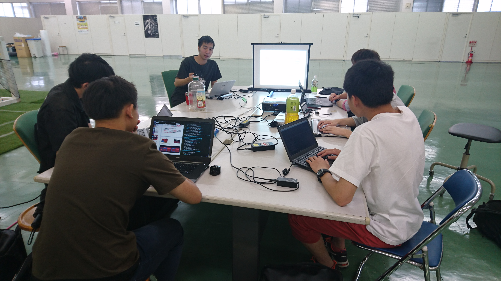

# RoboCup CITBrains KidSize League Study Session Summer 2017

## Topic
Game AI Architecture

## Date 
2017/09/07

## Content
* Sample Code Written in Python for:
    * Finite State Machine
    * Goal Oriented Action Planning
    * Hierarchical Task Network Planning
* PDF Slide

## Photo

